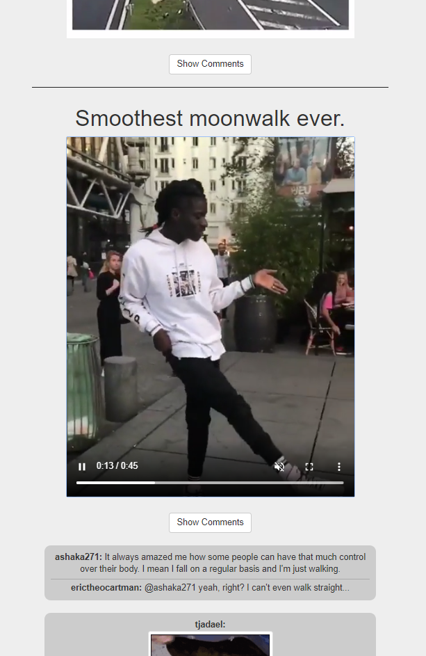

# 9gag

A Node.js package to download 9GAG posts and comments.

It can be used as a module to scrap memes or as a command line application to save data to a local folder and generate an HTML file for offline use.

Node.js 8 or above required due to Async/Await usage.

## Install

    npm install 9gag

Since Puppeteer is needed to handle Cloudflare, check this [troubleshooting](https://github.com/puppeteer/puppeteer/blob/master/docs/troubleshooting.md) page to setup required dependencies.

## Examples

### CLI

    9gag <post_count> [<folder> default:output] [<section> default:hot] [<comment_count> default:0]
    9gag 10
    9gag 20 output trending 3

## Testing

    # unit
    npm run test:unit
    # unit + integration
    npm test

### Scrap posts and comments with images

    const NineGag = require('9gag');
    const HttpClient = NineGag.HttpClient;
    const Scraper = NineGag.Scraper;
    const Downloader = NineGag.Downloader;

    async function memes() {
        try {
            const httpClient = new HttpClient();
            await httpClient.init();
            const scraper = new Scraper(httpClient, 10, 'hot', 3);
            const posts = await scraper.scrap();
            await httpClient.close();
            posts.forEach(p => console.log(`${p.title} -> ${p.content} -> ${p.comments.map(c => c.content)[0]}`));
            await new Downloader('output').downloadPosts(posts);
        }
        catch (err) {
            console.error(err);
        }
    }

    memes();

### HTML output

